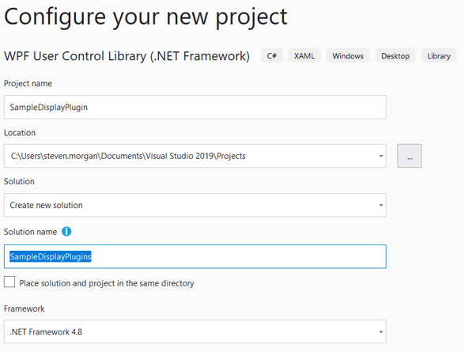
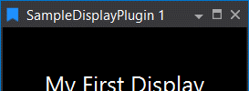
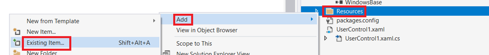

# Create Custom Display from Scratch

## Create Project

Create a new _C# WPF User Control Library (.NET Framework)_ project with Visual Studio.

!!! tip

    Enter _wpf_ into the Search box


!!! caution

    _.NET Framework WPF_ project and not _.Net Core WPF_ project




!!! attention

    Ensure there is _Plugin_ somewhere within the name, otherwise ATLAS will not load the plugin

!!! note

    This project type includes a template for the _View_

## Update Assembly Information

Edit project settings:


Click _Assembly Information..._


Modify: Title, Description and GUID (if not already set) properties:


_Title_ property corresponds to Display Window title:



_Description_ property corresponds to Display Icon tooltip:


!!! attention

    A GUID must be specified otherwise ATLAS will fail to start.

    Use Tools->Create GUID as necessary:

    

    Copy Registry Format:

    

    Remember to remove '{' and '}' 

## Add reference to _Atlas.DisplayAPI_ NuGet package

Manage NuGet packages of project:


Browse to Atlas.DisplayAPI NuGet package and install:


Once installed the references will be:


## Add an icon for the toolbar

Add _Resources_ folder to project:


Which should look like:


Add existing item to Resources folder:



!!! note

    Icon should be a suitable 16 x 16 pixel PNG file compatible with ATLAS dark theme


Select and _Add_ icon:


Which should look like:


Ensure _Build Action_ is set to _Resource_:


## Configure _View_ class

The _View_ provides the custom visualization presentation. 

- Rename `UserControl1` to `SampleDisplayView`
    - Rename `UserControl1.xaml` to `SampleDisplayView.xaml`
        - Update `x:Class` to `SampleDisplayPlugin.SampleDisplayView`
    - Rename `UserControl1.xaml.cs` to `SampleDisplayView.xaml.cs`
        - Rename `UserControl1` class to `SampleDisplayView`

    ```c#
    namespace SampleDisplayPlugin
    {
        public partial class SampleDisplayView
        {
            public SampleDisplayView()
            {
                InitializeComponent();
            }
        }
    }
    ```

- Add a simple `<TextBlock>` to display white text to the _XAML_

    ```xml hl_lines="9-13"
    <UserControl x:Class="SampleDisplayPlugin.SampleDisplayView"
                 xmlns="http://schemas.microsoft.com/winfx/2006/xaml/presentation"
                 xmlns:x="http://schemas.microsoft.com/winfx/2006/xaml"
                 xmlns:mc="http://schemas.openxmlformats.org/markup-compatibility/2006"
                 xmlns:d="http://schemas.microsoft.com/expression/blend/2008"
                 mc:Ignorable="d"
                 d:DesignHeight="450" d:DesignWidth="800">
        <Grid>
            <TextBlock VerticalAlignment="Center"
                       HorizontalAlignment="Center"
                       Foreground="White"
                       FontSize="20"
                       Text="My First Display" />
        </Grid>
    </UserControl>
    ```

!!! note

    Text is white to be compatible with ATLAS dark theme

## Add _View Model_ class

The _ViewModel_ provides the business logic behind the custom visualization. 

Add _New Item_ to project:


Add a _Class_ named _SampleDisplayViewModel_ to project:


!!! important

    Remember to derive the _ViewModel_ from _DisplayPluginViewModel_ otherwise the custom display will not be available to ATLAS  

```c# hl_lines="5"
using MAT.Atlas.Client.Presentation.Displays;

namespace SampleDisplayPlugin
{
    public class SampleDisplayViewModel : DisplayPluginViewModel
    {
    }
}
```

!!! note

    Subsequent tutorials will expand the _ViewModel_ class to interact with the _View_ and retrieve data from ATLAS to visualize.

## Add _Plugin_ class

The _Plugin_ class registers the _View_ class, _ViewModel_ class and _Icon_ location with ATLAS.

- Create a class named _Plugin_ as per [View Model class](#add-view-model-class)
    - Derive from _DisplayPlugin<Plugin>_
- Decorate class with _DisplayPlugin_ attribute
    - Set appropriate values for: _View_, _ViewModel_ and _IconUrl_ properties

```c# hl_lines="5-9"
using MAT.Atlas.Client.Presentation.Plugins;

namespace SampleDisplayPlugin
{
    [DisplayPlugin(
        View = typeof(SampleDisplayView),
        ViewModel = typeof(SampleDisplayViewModel),
        IconUri = "Resources/icon.png")]
    public class Plugin : DisplayPlugin<Plugin>
    {
    }
}
```

## Add _PluginModule_ class

The _PluginModule_ class provides the entry point for ATLAS to initialise the custom display plugin.

- Create a class named _PluginModule_ as per [View Model class](#add-view-model-class)
    - Derive from _Module_ (provided by _Autofac_)
- Decorate class with _Export_ attribute (provided by _MEF_)
    - Add a reference to _System.ComponentModel.Composition_ as required
- Override _Load_ method and register display plugin 

```c# hl_lines="10-11 13 15"
using System.ComponentModel.Composition;

using Autofac;
using Autofac.Core;

using MAT.Atlas.Client.Presentation.Plugins;

namespace SampleDisplayPlugin
{
    [Export(typeof(IModule))]
    public class PluginModule : Module
    {
        protected override void Load(ContainerBuilder builder)
        {
            DisplayPlugin<Plugin>.Register(builder);
        }
    }
}
```

## Optional: combine _PluginModule_ and _Plugin_ class

To reduce boilerplate code the _plugin_ class may be nested within the _PluginModule_ class as desired

```c# hl_lines="13-23"
using System.ComponentModel.Composition;

using Autofac;
using Autofac.Core;

using MAT.Atlas.Client.Presentation.Plugins;

namespace SampleDisplayPlugin
{
    [Export(typeof(IModule))]
    public class PluginModule : Module
    {
        protected override void Load(ContainerBuilder builder)
        {
            Plugin.Register(builder);
        }

        [DisplayPlugin(
            View = typeof(SampleDisplayView),
            ViewModel = typeof(SampleDisplayViewModel),
            IconUri = "Resources/icon.png")]
        private class Plugin : DisplayPlugin<Plugin>
        {
        }
    }
}
```

## Build, Deploy and Debug

- Build _Debug_ or _Release_ configuration
- Copy plugin DLL to ATLAS 10 program files
    - Manually copy from bin/Debug or bin/Release
    - Add a post build step to automatically copy, see [Deployment](#deployment-script)
- Debug using ATLAS 10

    

- Assuming all went well, you should see an icon for your custom display and upon clicking


## Deployment Script

